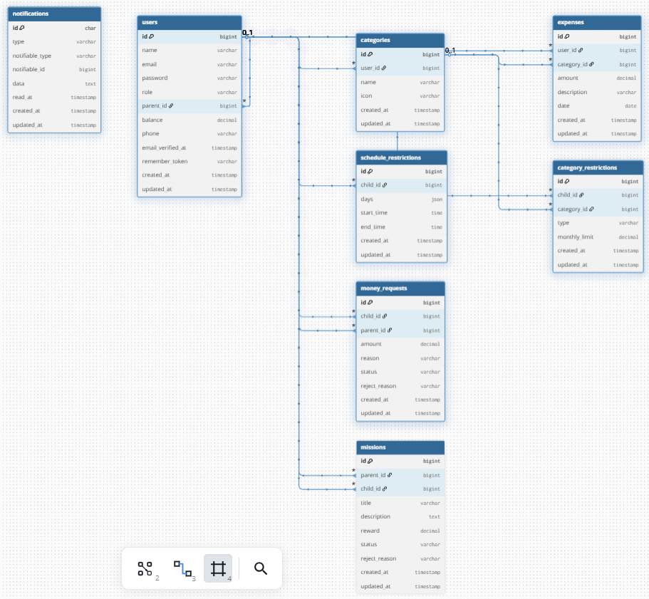

# Capital Life - README Tecnico

Version: 1.0  
Idioma: Espanol  
Fecha: 2026-04-10

---

## Tabla de Contenidos

1. [Resumen Ejecutivo](#1-resumen-ejecutivo)
2. [Stack Tecnologico](#2-stack-tecnologico)
3. [Estructura General del Proyecto](#3-estructura-general-del-proyecto)
4. [Modelo de Datos y Relaciones](#4-modelo-de-datos-y-relaciones)
5. [Modulos Funcionales](#5-modulos-funcionales)
6. [Autenticacion y Seguridad](#6-autenticacion-y-seguridad)
7. [Integracion IA + WhatsApp](#7-integracion-ia--whatsapp)
8. [Frontend e Inertia](#8-frontend-e-inertia)
9. [Rutas Principales](#9-rutas-principales)
10. [Ejecucion, Build y Calidad](#10-ejecucion-build-y-calidad)
11. [Pruebas y Cobertura Actual](#11-pruebas-y-cobertura-actual)
12. [Riesgos Tecnicos y Deuda](#12-riesgos-tecnicos-y-deuda)
13. [Guia de Mantenimiento](#13-guia-de-mantenimiento)
14. [Estado Actual](#14-estado-actual)
15. [Arquitectura de Decisiones](#15-arquitectura-de-decisiones)
16. [Guia de Contribucion](#16-guia-de-contribucion)
17. [Deployment](#17-deployment)

---

## 1. Resumen Ejecutivo

Capital Life es una aplicacion web de finanzas familiares construida con Laravel + Inertia + React que permite a los padres gestionar el dinero de sus hijos de forma educativa y controlada.

(En carpeta de Kiro puedes encontrar los requerimientos del proyecto con sus historias de usuarios)

### Problema que Resuelve
Muchas familias buscan ensenar educacion financiera a sus hijos, pero carecen de herramientas digitales que combinen:
- Control parental sobre gastos
- Autonomia supervisada para los hijos
- Gamificacion mediante misiones
- Accesibilidad via WhatsApp con IA

### Solucion
Capital Life ofrece una plataforma completa donde:
- Los padres crean cuentas para sus hijos y les transfieren dinero
- Los hijos registran gastos dentro de restricciones configurables
- Se establecen misiones con recompensas economicas
- Todo es accesible via web y WhatsApp con asistente IA

### Roles principales
- `parent`: administra dinero, hijos, restricciones y misiones.
- `child`: registra gastos y ejecuta misiones bajo reglas parentales.

### Objetivos funcionales
- Registro y seguimiento de gastos con categorizacion
- Cuentas hijo vinculadas a una cuenta padre
- Restricciones por horario y por categoria para cuentas child
- Misiones con recompensa economica para incentivar tareas
- Transferencias `parent -> child` con registro contable completo
- Integracion WhatsApp + IA para operaciones conversacionales
- Visualizacion de datos financieros con graficas interactivas
- Sistema de autenticacion robusto con 2FA

### Uso de IA
Se utilizó inteligencia artificial en varias etapas del proyecto. Por un lado, nos ayudó a rebotar ideas y a investigar las prácticas actuales de la industria: qué se está haciendo y qué oportunidades aún no se están explotando.
Además, la IA fue clave para definir la estructura del proyecto y diseñar una división eficiente de las tareas entre los miembros del equipo.
Finalmente, también participó activamente en la creación y optimización del código.

## 2. Stack Tecnologico

### Diagrama de Arquitectura

```
┌─────────────────────────────────────────────────────────────┐
│                        FRONTEND                              │
│  ┌──────────────────────────────────────────────────────┐  │
│  │  React 19 + TypeScript + Tailwind CSS               │  │
│  │  - Componentes UI (Radix UI)                        │  │
│  │  - Graficas (Chart.js)                              │  │
│  │  - Notificaciones (Sonner)                          │  │
│  └──────────────────────────────────────────────────────┘  │
│                          ↕ Inertia.js                       │
│  ┌──────────────────────────────────────────────────────┐  │
│  │  Laravel 13 (PHP 8.3)                               │  │
│  │  - Controllers (Logica de negocio)                  │  │
│  │  - Models (Eloquent ORM)                            │  │
│  │  - Fortify (Autenticacion)                          │  │
│  │  - Laravel AI (Agentes)                             │  │
│  └──────────────────────────────────────────────────────┘  │
│                        BACKEND                               │
└─────────────────────────────────────────────────────────────┘
                              ↕
        ┌─────────────────────────────────────┐
        │     Base de Datos (SQLite/MySQL)    │
        │  - users, expenses, categories      │
        │  - missions, restrictions           │
        └─────────────────────────────────────┘

                              ↕
        ┌─────────────────────────────────────┐
        │      Integraciones Externas         │
        │  - WhatsApp Business API            │
        │  - Google Gemini AI                 │
        └─────────────────────────────────────┘
```

### Backend
- **PHP 8.3**: Lenguaje base con tipado fuerte y features modernas
- **Laravel Framework 13**: Framework PHP full-stack con Eloquent ORM
- **Inertia Laravel 3**: Adaptador server-side para SPA sin API REST
- **Laravel Fortify**: Autenticacion completa (login, registro, 2FA, email verification)
- **Laravel AI**: Framework para agentes conversacionales y tools
- **Laravel Wayfinder**: Generacion de rutas tipadas compartidas con frontend
- **SQLite/MySQL**: Base de datos relacional (configurable)

### Frontend
- **React 19**: Biblioteca UI con hooks y componentes funcionales
- **Inertia React 3**: Adaptador client-side para comunicacion con Laravel
- **TypeScript**: Superset de JavaScript con tipado estatico
- **Tailwind CSS v4**: Framework CSS utility-first
- **Radix UI**: Componentes accesibles sin estilos (headless UI)
- **Chart.js + react-chartjs-2**: Visualizacion de datos financieros
- **Sonner**: Sistema de notificaciones toast
- **Lucide React**: Iconos SVG optimizados

### Integracion Externa
- **WhatsApp Business API**: Webhook para mensajes entrantes
- **Google Gemini AI**: Modelo de lenguaje para agente conversacional

### Calidad y Tooling
- **Pest**: Framework de testing moderno para PHP
- **Pint**: Formateador de codigo PHP (basado en PHP-CS-Fixer)
- **ESLint + Prettier**: Linting y formateo de JavaScript/TypeScript
- **Vite 8**: Build tool rapido con HMR para desarrollo

## 3. Estructura General del Proyecto

```text
app/
  Http/Controllers      -> Logica HTTP y reglas de negocio por modulo
  Http/Requests         -> Validaciones de entrada (FormRequest)
  Models                -> Entidades Eloquent
  Ai/Agents, Ai/Tools   -> IA conversacional para WhatsApp
  Providers             -> Configuracion de servicios

resources/js/
  pages                 -> Vistas Inertia por dominio
  components            -> Componentes UI reutilizables
  routes, wayfinder     -> Helpers de rutas tipadas
  hooks/types/layouts   -> Infraestructura frontend

routes/
  web.php               -> Rutas principales auth + verified
  settings.php          -> Rutas de configuracion de usuario

database/
  migrations            -> Esquema de datos
  factories/seeders     -> Datos de prueba

tests/
  Feature, Unit         -> Pruebas Pest
```

## 4. Modelo de Datos y Relaciones

### Estructura de Base de Datos

Diagrama relacional actual del proyecto:



### Entidades Principales

#### User (users)
Tabla central que representa tanto padres como hijos.

**Campos clave:**
- `id`: Identificador unico
- `name`: Nombre completo
- `email`: Email unico para autenticacion
- `password`: Hash bcrypt
- `role`: Enum `parent | child`
- `parent_id`: FK a users (null para parent, obligatorio para child)
- `balance`: Decimal(10,2) - Saldo actual en cuenta
- `phone`: Varchar(20) nullable - Para integracion WhatsApp
- `two_factor_secret`: Text nullable - Para 2FA
- `email_verified_at`: Timestamp - Verificacion de email

**Relaciones:**
- `hasMany(User, 'parent_id')` → children: Lista de hijos (solo parent)
- `belongsTo(User, 'parent_id')` → parent: Padre del usuario (solo child)
- `hasMany(Expense)` → expenses: Gastos del usuario
- `hasMany(Category)` → categories: Categorias personalizadas
- `hasMany(Mission, 'parent_id')` → createdMissions: Misiones creadas (parent)
- `hasMany(Mission, 'child_id')` → assignedMissions: Misiones asignadas (child)
- `hasMany(ScheduleRestriction, 'child_id')` → scheduleRestrictions
- `hasMany(CategoryRestriction, 'child_id')` → categoryRestrictions

**Reglas de negocio:**
- Balance nunca puede ser negativo
- Phone debe ser unico si no es null
- Child debe tener parent_id obligatorio
- Parent no puede tener parent_id

#### Expense (expenses)
Registro de cada gasto realizado por un usuario.

**Campos clave:**
- `id`: Identificador unico
- `user_id`: FK a users - Quien realizo el gasto
- `category_id`: FK a categories - Categoria del gasto
- `amount`: Decimal(10,2) - Monto del gasto
- `description`: Text - Descripcion detallada
- `date`: Date - Fecha del gasto (puede ser diferente a created_at)
- `created_at`, `updated_at`: Timestamps automaticos

**Relaciones:**
- `belongsTo(User)` → user: Usuario que realizo el gasto
- `belongsTo(Category)` → category: Categoria del gasto

**Reglas de negocio:**
- Amount debe ser positivo
- Al crear: decrementa balance del user (si es child)
- Al actualizar: ajusta diferencia en balance
- Al eliminar: reembolsa amount al balance
- Validaciones adicionales para child: horario, categoria bloqueada/limitada

#### Category (categories)
Catalogo de categorias de gastos por usuario.

**Campos clave:**
- `id`: Identificador unico
- `user_id`: FK a users - Propietario de la categoria
- `name`: Varchar(255) - Nombre de la categoria
- `icon`: Varchar(50) - Nombre del icono (Lucide)
- `created_at`, `updated_at`: Timestamps

**Relaciones:**
- `belongsTo(User)` → user: Propietario
- `hasMany(Expense)` → expenses: Gastos en esta categoria
- `hasMany(CategoryRestriction)` → restrictions: Restricciones aplicadas

**Categorias especiales:**
- `Family`: Categoria reservada para transferencias parent-child y rewards de misiones
- Cada usuario puede crear categorias personalizadas

#### Mission (missions)
Sistema de tareas con recompensas economicas.

**Campos clave:**
- `id`: Identificador unico
- `parent_id`: FK a users - Quien creo la mision
- `child_id`: FK a users - A quien se asigno
- `title`: Varchar(255) - Titulo de la mision
- `description`: Text - Descripcion detallada
- `reward`: Decimal(10,2) - Recompensa al completar
- `status`: Enum `activa | en_revision | completada | rechazada`
- `reject_reason`: Text nullable - Razon de rechazo
- `created_at`, `updated_at`: Timestamps

**Relaciones:**
- `belongsTo(User, 'parent_id')` → parent: Creador
- `belongsTo(User, 'child_id')` → child: Asignado

**Flujo de estados:**
```
activa → (child completa) → en_revision → (parent aprueba) → completada
                                        → (parent rechaza) → rechazada
```

**Reglas de negocio:**
- Solo parent puede crear misiones
- Solo child asignado puede marcar como completada
- Solo parent creador puede aprobar/rechazar
- Al aprobar:
  - Child recibe reward en balance
  - Parent se debita reward
  - Se crea expense en parent con categoria Family

#### ScheduleRestriction (schedule_restrictions)
Define ventanas horarias permitidas para que child registre gastos.

**Campos clave:**
- `id`: Identificador unico
- `child_id`: FK a users - Child al que aplica
- `days`: JSON array - Dias de la semana [0-6] (0=Domingo)
- `start_time`: Time - Hora de inicio (ej: 09:00:00)
- `end_time`: Time - Hora de fin (ej: 21:00:00)
- `created_at`, `updated_at`: Timestamps

**Relaciones:**
- `belongsTo(User, 'child_id')` → child: Usuario restringido

**Ejemplo:**
```json
{
  "days": [1, 2, 3, 4, 5],  // Lunes a Viernes
  "start_time": "09:00:00",
  "end_time": "21:00:00"
}
```

**Validacion:**
- Al crear expense, se verifica que hora actual este dentro de alguna ventana permitida
- Si no hay restricciones, se permite cualquier horario

#### CategoryRestriction (category_restrictions)
Bloquea o limita gastos en categorias especificas para child.

**Campos clave:**
- `id`: Identificador unico
- `child_id`: FK a users - Child al que aplica
- `category_id`: FK a categories - Categoria restringida
- `type`: Enum `blocked | limited`
- `monthly_limit`: Decimal(10,2) nullable - Limite mensual (solo si type=limited)
- `created_at`, `updated_at`: Timestamps

**Relaciones:**
- `belongsTo(User, 'child_id')` → child: Usuario restringido
- `belongsTo(Category)` → category: Categoria restringida

**Tipos de restriccion:**
- `blocked`: No se permite ningun gasto en esta categoria
- `limited`: Se permite hasta monthly_limit por mes calendario

**Validacion:**
- Al crear expense, se verifica:
  - Si categoria esta bloqueada → error
  - Si categoria esta limitada → suma gastos del mes actual y valida contra limite

### Diagrama de Flujo de Datos

```
┌──────────┐
│  Parent  │
└────┬─────┘
     │
     ├─ crea ──→ ┌──────────┐
     │           │  Child   │
     │           └────┬─────┘
     │                │
     ├─ transfiere $ ─┤
     │                │
     ├─ crea ──→ ┌────────────┐
     │           │  Mission   │ ←── completa ── Child
     │           └────────────┘
     │
     ├─ configura ──→ ┌──────────────────────┐
     │                 │  ScheduleRestriction │
     │                 └──────────────────────┘
     │
     └─ configura ──→ ┌──────────────────────┐
                       │  CategoryRestriction │
                       └──────────────────────┘

Parent/Child registran ──→ ┌──────────┐
                            │ Expense  │ ──→ pertenece a ──→ Category
                            └──────────┘
```

## 5. Modulos Funcionales

### 5.1 Gastos
- CRUD en `ExpenseController`.
- Endpoint de resumen por periodo (`day/week/month`) para graficas.

En cuentas `child`:
- valida horario permitido,
- valida categoria bloqueada/limitada,
- valida saldo suficiente,
- ajusta balance en `store/update/destroy` dentro de transacciones.

En cuentas `parent`:
- registra gasto sin descuento automatico en el flujo general (excepto flujos especiales).

### 5.2 Cuentas Hijo
- `parent` puede crear, listar, ver detalle y desvincular hijos.
- `child` no debe acceder al modulo de gestion de hijos.

Transferencias directas `parent -> child`:
- endpoint `give-money`,
- incrementa balance del hijo,
- decrementa balance del padre,
- registra gasto en parent con categoria `Family`.

### 5.3 Restricciones
- Restriccion de horario (`schedule`): dias + rango horario.
- Restriccion por categoria:
  - `blocked`: no se permite gasto,
  - `limited`: limite mensual.
- Se configuran por parent para cada child.
- Se aplican al crear gastos de cuentas child.

### 5.4 Misiones
- parent crea misiones para un child.
- child marca mision como completada -> `en_revision`.

Al aprobar:
- pasa a `completada`,
- child recibe `reward`,
- parent se debita por el reward,
- se registra gasto parent en categoria `Family`.

Al rechazar:
- pasa a `rechazada`,
- se conserva `reject_reason`.

### 5.5 Dashboard y Visualizacion
- Dashboard principal con saldo y actividad.
- Dashboard child con analitica por periodos.
- Charts con Chart.js para historico y distribucion.

## 6. Autenticacion y Seguridad

Fortify habilita:
- login/registro,
- reset de password,
- verificacion de email,
- 2FA.

Seguridad operativa:
- rutas protegidas por middleware `auth + verified`,
- autorizacion por rol y ownership en controladores,
- validaciones server-side con FormRequest y validaciones inline.

Observacion:
- El webhook WhatsApp esta fuera de CSRF por necesidad tecnica.

## 7. Integracion IA + WhatsApp

### Arquitectura de la Integracion

Capital Life integra WhatsApp Business API con un agente conversacional basado en Google Gemini para permitir operaciones financieras mediante lenguaje natural.

### Flujo Completo
1. **Recepcion**: WhatsApp envia evento al webhook `/webhook/whatsapp`
2. **Identificacion**: Se busca usuario por numero de telefono en campo `phone`
3. **Instanciacion**: Se crea instancia de `WhatsAppExpenseAgent` con provider Gemini
4. **Procesamiento**: El agente analiza el mensaje y determina la intencion
5. **Ejecucion**: Se invocan tools especificas segun la intencion detectada
6. **Respuesta**: Se envia respuesta formateada via Graph API de WhatsApp

### Tools Disponibles

#### Para Usuarios Parent y Child
- **RegisterExpenseTool**: Registra un gasto con categoria, monto y descripcion
  - Ejemplo: "registra gasto de $50 en comida"
  - Valida: balance, restricciones (si es child), categoria existente

- **GetExpenseHistoryTool**: Obtiene historial de gastos del usuario
  - Ejemplo: "muestra mis gastos de esta semana"
  - Parametros: periodo (day/week/month), limite de resultados

#### Solo para Parent
- **CheckChildrenExpensesTool**: Consulta gastos de todos los hijos
  - Ejemplo: "como van los gastos de mis hijos"
  - Retorna: resumen por hijo con totales

- **RegisterChildExpenseTool**: Registra gasto en nombre de un hijo
  - Ejemplo: "registra $30 en transporte para Juan"
  - Valida: hijo existe, restricciones del hijo

- **GetChildExpenseHistoryTool**: Obtiene historial de un hijo especifico
  - Ejemplo: "muestra gastos de Maria esta semana"

- **CreateMissionTool**: Crea nueva mision para un hijo
  - Ejemplo: "crea mision para Juan: lavar auto, recompensa $50"
  - Parametros: child_id, titulo, descripcion, reward

#### Solo para Child
- **CompleteMissionTool**: Marca mision como completada
  - Ejemplo: "complete la mision de lavar el auto"
  - Cambia estado a "en_revision" para aprobacion del parent

### Configuracion del Webhook

#### Verificacion (GET)
WhatsApp valida el webhook enviando un challenge:
```php
// WhatsAppWebhookController@verify
if ($request->query('hub_verify_token') === config('services.whatsapp.verify_token')) {
    return response($request->query('hub_challenge'));
}
```

#### Procesamiento de Mensajes (POST)
```php
// WhatsAppWebhookController@handle
$entry = $request->input('entry.0');
$message = $entry['changes'][0]['value']['messages'][0] ?? null;

if ($message && $message['type'] === 'text') {
    $phone = $message['from'];
    $text = $message['text']['body'];
    
    $user = User::where('phone', $phone)->first();
    $agent = new WhatsAppExpenseAgent($user);
    $response = $agent->process($text);
    
    // Enviar respuesta via Graph API
    Http::withToken(config('services.whatsapp.token'))
        ->post("https://graph.facebook.com/v17.0/{$phoneId}/messages", [
            'messaging_product' => 'whatsapp',
            'to' => $phone,
            'text' => ['body' => $response]
        ]);
}
```

### Variables de Entorno Requeridas
```env
# WhatsApp Business API
WHATSAPP_PHONE_ID=123456789012345          # ID del numero de telefono
WHATSAPP_TOKEN=EAAxxxxxxxxxxxxx            # Token de acceso permanente
WHATSAPP_VERIFY_TOKEN=mi_token_secreto     # Token para verificacion de webhook

# Google Gemini AI
GOOGLE_API_KEY=AIzaSyXXXXXXXXXXXXXXXXXX   # API key de Google AI Studio
```

### Configuracion en Meta Developer

1. **Crear App de WhatsApp Business**
   - Ir a https://developers.facebook.com
   - Crear nueva app tipo "Business"
   - Agregar producto "WhatsApp"

2. **Configurar Webhook**
   - URL: `https://tu-dominio.com/webhook/whatsapp`
   - Verify Token: mismo valor que `WHATSAPP_VERIFY_TOKEN`
   - Suscribirse a: `messages`

3. **Obtener Credenciales**
   - Phone Number ID: en configuracion de WhatsApp
   - Access Token: generar token permanente en configuracion

4. **Probar Webhook**
   - Usar numero de prueba proporcionado por Meta
   - Enviar mensaje de prueba
   - Verificar logs con `php artisan pail`

### Ejemplos de Conversaciones

#### Registrar Gasto
```
Usuario: "gaste 45 pesos en uber"
Agente: "✅ Gasto registrado: $45.00 en categoria Transporte. 
         Balance actual: $455.00"
```

#### Consultar Historial
```
Usuario: "cuanto he gastado esta semana"
Agente: "📊 Gastos de la semana:
         - Comida: $120.00
         - Transporte: $85.00
         - Entretenimiento: $50.00
         Total: $255.00"
```

#### Crear Mision (Parent)
```
Usuario: "crea mision para Ana: sacar la basura, recompensa 20 pesos"
Agente: "✅ Mision creada para Ana:
         Titulo: Sacar la basura
         Recompensa: $20.00
         Estado: Activa"
```

#### Completar Mision (Child)
```
Usuario: "complete la mision de sacar la basura"
Agente: "✅ Mision marcada como completada.
         Esperando aprobacion de tu padre/madre."
```

### Manejo de Errores

El agente maneja errores comunes:
- **Usuario no encontrado**: "No encontre tu cuenta. Registra tu telefono en la app web."
- **Saldo insuficiente**: "No tienes saldo suficiente. Balance actual: $10.00"
- **Fuera de horario**: "No puedes registrar gastos en este horario. Horario permitido: 9am-9pm"
- **Categoria bloqueada**: "La categoria 'Juegos' esta bloqueada por tu padre/madre"
- **Parametros faltantes**: "Por favor especifica el monto y la categoria del gasto"

### Seguridad

- **Verificacion de Firma**: WhatsApp firma cada request con `X-Hub-Signature-256`
- **CSRF Exception**: Webhook excluido de CSRF por necesidad tecnica
- **Rate Limiting**: Implementar throttling para prevenir abuso
- **Validacion de Telefono**: Solo usuarios registrados pueden operar

## 8. Frontend e Inertia

### Arquitectura Frontend

Capital Life utiliza **Inertia.js** como puente entre Laravel y React, eliminando la necesidad de construir una API REST tradicional. Esto permite:
- Desarrollo full-stack con un solo lenguaje de routing (Laravel)
- Compartir validaciones entre backend y frontend
- SSR (Server-Side Rendering) para mejor SEO y performance inicial
- Navegacion SPA sin recargas de pagina

### Estructura de Componentes

```
resources/js/
├── pages/                    # Paginas Inertia (rutas)
│   ├── Auth/                # Login, Register, Verify Email
│   ├── Dashboard/           # Dashboard principal
│   ├── Expenses/            # CRUD de gastos
│   ├── Children/            # Gestion de hijos
│   ├── Missions/            # Sistema de misiones
│   ├── Categories/          # Gestion de categorias
│   └── Settings/            # Configuracion de usuario
├── components/              # Componentes reutilizables
│   ├── ui/                  # Componentes base (Button, Input, Card)
│   ├── expenses/            # ExpenseForm, ExpenseList, ExpenseChart
│   ├── missions/            # MissionCard, MissionForm
│   ├── children/            # ChildCard, GiveMoneyForm
│   └── layout/              # Sidebar, Header, Footer
├── layouts/                 # Layouts principales
│   ├── AppLayout.tsx        # Layout autenticado con sidebar
│   └── GuestLayout.tsx      # Layout para paginas publicas
├── hooks/                   # Custom hooks
│   ├── useFlash.ts          # Notificaciones flash
│   ├── useAuth.ts           # Usuario autenticado
│   └── useWayfinder.ts      # Rutas tipadas
├── types/                   # Tipos TypeScript
│   ├── index.d.ts           # Tipos globales
│   └── models.ts            # Tipos de modelos
└── lib/                     # Utilidades
    ├── utils.ts             # Helpers generales
    └── cn.ts                # Class name merger
```

### Componentes UI Principales

#### Dashboard
- **Parent Dashboard**: Resumen de balance, lista de hijos, gastos recientes, graficas
- **Child Dashboard**: Balance personal, misiones activas, historial de gastos, graficas por periodo

#### Expenses
- **ExpenseForm**: Formulario con validacion para crear/editar gastos
  - Select de categoria con iconos
  - Input de monto con formato de moneda
  - Textarea para descripcion
  - Date picker para fecha del gasto
- **ExpenseList**: Tabla paginada con filtros por fecha y categoria
- **ExpenseChart**: Graficas de Chart.js
  - Line chart: Gastos por dia/semana/mes
  - Pie chart: Distribucion por categoria

#### Children (Solo Parent)
- **ChildCard**: Tarjeta con informacion del hijo
  - Nombre, email, balance actual
  - Botones: Ver detalle, Dar dinero, Configurar restricciones
- **GiveMoneyForm**: Modal para transferir dinero
  - Input de monto
  - Confirmacion con preview de balances resultantes

#### Missions
- **MissionCard**: Tarjeta de mision con estado visual
  - Badge de estado (activa/en_revision/completada/rechazada)
  - Titulo, descripcion, recompensa
  - Botones segun rol y estado
- **MissionForm**: Formulario para crear mision (parent)
  - Select de hijo
  - Inputs de titulo, descripcion, recompensa

#### Restrictions (Solo Parent)
- **ScheduleRestrictionForm**: Configurar horarios permitidos
  - Checkboxes para dias de la semana
  - Time pickers para inicio y fin
- **CategoryRestrictionForm**: Bloquear o limitar categorias
  - Select de categoria
  - Radio buttons: blocked/limited
  - Input de limite mensual (si limited)

### Sistema de Notificaciones

Utiliza **Sonner** para toasts con integracion de flash messages de Laravel:

```typescript
// Hook personalizado
const useFlash = () => {
  const { flash } = usePage().props;
  
  useEffect(() => {
    if (flash.success) toast.success(flash.success);
    if (flash.error) toast.error(flash.error);
    if (flash.info) toast.info(flash.info);
  }, [flash]);
};
```

### Wayfinder - Rutas Tipadas

Laravel Wayfinder genera rutas tipadas compartidas entre backend y frontend:

```typescript
// Generado automaticamente
import { route } from '@/routes';

// Uso en componentes
<Link href={route('expenses.create')}>Nuevo Gasto</Link>
<Link href={route('children.show', { child: childId })}>Ver Hijo</Link>

// Con parametros de query
router.get(route('expenses.index', { period: 'week' }));
```

### Temas y Estilos

- **Tailwind CSS v4**: Utility-first con configuracion personalizada
- **Modo Oscuro**: Soporte completo con `dark:` variants
- **Responsive**: Mobile-first design con breakpoints
- **Accesibilidad**: Componentes Radix UI con ARIA completo

### SSR (Server-Side Rendering)

Configurado en `config/inertia.php`:

```php
'ssr' => [
    'enabled' => true,
    'url' => 'http://127.0.0.1:13714',
],
```

**Beneficios:**
- Mejor SEO para paginas publicas
- Faster First Contentful Paint (FCP)
- Mejor experiencia en conexiones lentas

**Nota importante:**
- Variables no importadas en componentes compartidos pueden romper el render inicial
- Validar imports tras refactors en layout/sidebar
- Usar `npm run build:ssr` antes de deployment

### Navegacion y Sidebar

Sidebar dinamico segun rol del usuario:

```typescript
// Parent ve:
- Dashboard
- Gastos
- Hijos
- Misiones
- Categorias
- Familia Capital

// Child ve:
- Dashboard
- Gastos
- Misiones
- Categorias
```

### Graficas y Visualizacion

**Chart.js** con react-chartjs-2 para visualizacion de datos:

```typescript
// Ejemplo: Gastos por periodo
<Line
  data={{
    labels: dates,
    datasets: [{
      label: 'Gastos',
      data: amounts,
      borderColor: 'rgb(75, 192, 192)',
      tension: 0.1
    }]
  }}
  options={{
    responsive: true,
    plugins: {
      legend: { position: 'top' },
      title: { display: true, text: 'Gastos del Mes' }
    }
  }}
/>
```

### Optimizaciones de Performance

- **Code Splitting**: Lazy loading de paginas con React.lazy
- **Memoization**: useMemo y useCallback para evitar re-renders
- **Debouncing**: En inputs de busqueda y filtros
- **Virtualization**: Para listas largas (react-window)
- **Image Optimization**: Lazy loading de imagenes

## 9. Rutas Principales

### Publica
- `/` (welcome) - Pagina de bienvenida

### Protegidas (`auth + verified`)
- `/dashboard` - Panel principal con resumen financiero
- `/expenses` - Gestion de gastos (CRUD)
  - `GET /expenses/summary?period={day|week|month}` - Datos para graficas
- `/children` - Gestion de cuentas hijo (solo parent)
  - `POST /children/{child}/give-money` - Transferir dinero a hijo
- `/children/{child}/restrictions/*` - Configurar restricciones
  - `/schedule` - Restricciones de horario
  - `/category` - Restricciones por categoria
- `/missions/*` - Sistema de misiones
  - `GET /missions` - Listar misiones
  - `POST /missions` - Crear mision (parent)
  - `PATCH /missions/{mission}/complete` - Marcar completada (child)
  - `PATCH /missions/{mission}/approve` - Aprobar (parent)
  - `PATCH /missions/{mission}/reject` - Rechazar (parent)
- `/categories` - Gestion de categorias personalizadas
- `/capital-family` - Vista de familia (parent)
- `/travel` - Modulo de viajes (futuro)

### Webhook
- `GET /webhook/whatsapp` - Verificacion de webhook
- `POST /webhook/whatsapp` - Recepcion de mensajes

### API Interna (Inertia)
Todas las rutas protegidas funcionan como endpoints Inertia que retornan:
- Respuestas JSON para peticiones XHR
- Renderizado HTML para navegacion directa

## 9.1 Ejemplos de Flujos de Usuario

### Flujo 1: Padre Crea Cuenta para Hijo
1. Parent se registra y verifica email
2. Navega a `/children` y crea cuenta hijo con email y password
3. Transfiere dinero inicial via `give-money`
4. Configura restricciones de horario (ej: solo 9am-9pm)
5. Configura restricciones de categoria (ej: bloquear "Juegos")
6. Hijo recibe credenciales y puede iniciar sesion

### Flujo 2: Hijo Registra Gasto
1. Child inicia sesion y navega a `/expenses`
2. Crea nuevo gasto con categoria, monto y descripcion
3. Sistema valida:
   - Horario permitido (ScheduleRestriction)
   - Categoria no bloqueada (CategoryRestriction)
   - Saldo suficiente (balance >= amount)
4. Si pasa validaciones:
   - Se crea expense
   - Se decrementa balance del child
   - Se muestra notificacion de exito
5. Si falla, se muestra error especifico

### Flujo 3: Mision con Recompensa
1. Parent crea mision para child:
   - Titulo: "Lavar el auto"
   - Descripcion: "Lavar y aspirar el auto familiar"
   - Recompensa: $50
2. Child ve mision en `/missions` con estado "activa"
3. Child completa tarea y marca mision como completada
4. Mision pasa a estado "en_revision"
5. Parent revisa y aprueba:
   - Mision pasa a "completada"
   - Child recibe $50 en su balance
   - Parent se debita $50
   - Se registra expense en parent con categoria "Family"

### Flujo 4: Operacion via WhatsApp
1. Usuario envia mensaje a numero de WhatsApp Business
2. Webhook recibe evento y identifica usuario por telefono
3. WhatsAppExpenseAgent procesa mensaje con Gemini AI
4. Agente identifica intencion (ej: "registra gasto de $20 en comida")
5. Agente invoca `RegisterExpenseTool` con parametros extraidos
6. Tool ejecuta logica de negocio (validaciones + registro)
7. Agente responde con confirmacion o error
8. Usuario recibe respuesta en WhatsApp

## 10. Ejecucion, Build y Calidad

### Requisitos Previos
- PHP >= 8.3
- Composer >= 2.0
- Node.js >= 20
- npm o pnpm
- SQLite o MySQL

### Instalacion Inicial
```bash
# Clonar repositorio
git clone <repository-url>
cd capital-life

# Instalar dependencias PHP
composer install

# Instalar dependencias JavaScript
npm install
# o
pnpm install

# Configurar entorno
cp .env.example .env
php artisan key:generate

# Ejecutar migraciones
php artisan migrate

# (Opcional) Cargar datos de prueba
php artisan db:seed --class=DemoSeeder
```

### Setup rapido
```bash
composer run setup
```
Este comando ejecuta automaticamente:
- Instalacion de dependencias
- Configuracion de entorno
- Migraciones de base de datos
- Generacion de claves

### Desarrollo
```bash
composer run dev
```

Este comando ejecuta en paralelo:
- `php artisan serve` - Servidor web en http://localhost:8000
- `php artisan queue:listen` - Procesador de colas
- `php artisan pail` - Visualizador de logs en tiempo real
- `npm run dev` - Servidor Vite con HMR en http://localhost:5173

### Build para Produccion
```bash
# Build de assets frontend
npm run build

# Build de SSR para Inertia
npm run build:ssr

# Optimizar autoload de Composer
composer install --optimize-autoloader --no-dev

# Cachear configuracion Laravel
php artisan config:cache
php artisan route:cache
php artisan view:cache
```

### Comandos de Calidad
```bash
# Ejecutar suite completa de tests
composer run test

# Tests con cobertura
composer run test:coverage

# Formatear codigo PHP
composer run lint

# Verificar estilo PHP sin modificar
composer run lint:check

# Verificar estilo JavaScript/TypeScript
npm run lint:check

# Formatear codigo JavaScript/TypeScript
npm run format

# Verificar formato sin modificar
npm run format:check

# Verificar tipos TypeScript
npm run types:check

# Ejecutar todos los checks de CI
composer run ci:check
```

### Variables de Entorno Importantes
```env
# Base de datos
DB_CONNECTION=sqlite
DB_DATABASE=/absolute/path/to/database.sqlite

# WhatsApp Business API
WHATSAPP_PHONE_ID=your_phone_id
WHATSAPP_TOKEN=your_access_token
WHATSAPP_VERIFY_TOKEN=your_verify_token

# Google Gemini AI
GOOGLE_API_KEY=your_gemini_api_key

# Aplicacion
APP_URL=http://localhost:8000
APP_ENV=local
APP_DEBUG=true
```

## 11. Pruebas y Cobertura Actual

### Suite de Tests Implementada
El proyecto utiliza **Pest** como framework de testing con una arquitectura de tests clara:

#### Tests de Autenticacion
- Registro de usuarios con validaciones
- Login y logout
- Verificacion de email
- Reset de password
- Two-Factor Authentication (2FA)

#### Tests de Dashboard
- Acceso segun rol (parent/child)
- Visualizacion de datos correctos
- Restricciones de acceso

#### Tests de Restricciones
- Validacion de horarios permitidos
- Bloqueo de gastos fuera de horario
- Restricciones por categoria (blocked/limited)
- Limites mensuales de gasto

#### Tests de Gastos
- CRUD completo de expenses
- Validacion de balance suficiente
- Ajuste automatico de saldos
- Restricciones aplicadas a cuentas child

### Ejecutar Tests
```bash
# Todos los tests
composer run test

# Tests especificos
php artisan test --filter=ExpenseTest

# Con cobertura
composer run test:coverage
```

### Cobertura Recomendada Adicional
Para fortalecer la suite de tests, se recomienda agregar:

1. **Tests de Misiones**
   - Creacion de mision por parent
   - Completado por child
   - Aprobacion con registro de gasto Family
   - Rechazo con razon
   - Validacion de reward y balance

2. **Tests de Transferencias**
   - `give-money` con doble movimiento de balance
   - Validacion de saldo suficiente en parent
   - Registro correcto de expense en categoria Family
   - Transacciones atomicas

3. **Tests de Restricciones Avanzadas**
   - `category limited` en limites mensuales
   - Calculo correcto de gasto acumulado
   - Multiples restricciones simultaneas

4. **Tests de Integracion WhatsApp**
   - Webhook con mocks/fakes del proveedor externo
   - Identificacion de usuario por telefono
   - Invocacion correcta de tools
   - Respuestas formateadas

5. **Tests de Autorizacion**
   - Acceso denegado a recursos de otros usuarios
   - Validacion de ownership en todas las operaciones
   - Restricciones por rol

### Estrategia de Testing
- **Unit Tests**: Logica de negocio aislada en modelos
- **Feature Tests**: Flujos completos HTTP con base de datos
- **Integration Tests**: Interaccion entre modulos (gastos + restricciones + balance)

## 12. Riesgos Tecnicos y Deuda

Riesgos observables:
- Complejidad creciente en controladores de negocio (`Expense/Mission/Child`).
- Reglas distribuidas en varios modulos (riesgo de inconsistencia).
- Integracion WhatsApp sin reintentos robustos por mensaje.
- Balance agregado sin ledger transaccional historico.

Mejoras recomendadas:
- Introducir capa de servicios de dominio para dinero (`wallet/ledger`).
- Crear tabla de transacciones monetarias auditables.
- Anadir politicas Laravel (`Policies`) para autorizacion centralizada.
- Fortalecer tests de regresion en operaciones monetarias.
- Aplicar rate limit explicito al webhook + idempotencia de eventos.

## 13. Guia de Mantenimiento

Buenas practicas:
- Mantener reglas de dinero dentro de transacciones DB atomicas.
- Evitar logica financiera en frontend.
- Documentar cada endpoint nuevo con:
  - rol permitido,
  - impacto en balance,
  - tablas afectadas,
  - manejo de errores.
- Si se agregan categorias especiales (ej. `Family`), mantener consistencia entre:
  - creacion backend,
  - filtros/listados,
  - graficas y colores.

## 14. Estado Actual

El proyecto esta funcional como MVP robusto orientado a familia:
- ✅ Control parental operativo con gestion completa de hijos
- ✅ Registro de gastos y restricciones activas (horario + categoria)
- ✅ Misiones con aprobacion/rechazo y recompensas
- ✅ Movimientos parent-child con trazabilidad por expense
- ✅ Integracion IA/WhatsApp lista para entorno con credenciales
- ✅ Dashboard con visualizacion de datos y graficas
- ✅ Autenticacion completa con 2FA
- ✅ Frontend responsive con Tailwind CSS
- ✅ Suite de tests automatizados con Pest

### Funcionalidades Destacadas
1. **Sistema de Balance Dual**: Padres e hijos tienen balances independientes con transferencias trazables
2. **Restricciones Inteligentes**: Combinacion de horarios y categorias para control granular
3. **Gamificacion**: Misiones con recompensas para incentivar comportamientos
4. **IA Conversacional**: Operaciones financieras via WhatsApp con lenguaje natural
5. **Visualizacion de Datos**: Graficas de gastos por periodo y categoria

### Metricas del Proyecto
- **Lineas de Codigo**: ~15,000 (PHP + TypeScript)
- **Modelos Eloquent**: 6 (User, Expense, Category, Mission, ScheduleRestriction, CategoryRestriction)
- **Controladores**: 8 principales
- **Componentes React**: ~50
- **Tests Automatizados**: 30+ casos de prueba
- **Migraciones**: 11 tablas

## 15. Arquitectura de Decisiones

### Por que Laravel + Inertia + React?
- **Laravel**: Framework maduro con ecosistema robusto para aplicaciones empresariales
- **Inertia**: Elimina necesidad de API REST, simplifica desarrollo full-stack
- **React**: Biblioteca UI popular con gran comunidad y componentes reutilizables

### Por que SQLite en desarrollo?
- Zero-configuration para setup rapido
- Facil migracion a MySQL/PostgreSQL en produccion
- Ideal para demos y desarrollo local

### Por que Laravel AI?
- Abstraccion de alto nivel para agentes conversacionales
- Soporte nativo para multiples providers (Gemini, OpenAI, Anthropic)
- Integracion natural con el ecosistema Laravel

### Por que WhatsApp?
- Plataforma de mensajeria mas usada en Latinoamerica
- API oficial de Meta con webhooks confiables
- Accesibilidad sin necesidad de app adicional

## 16. Guia de Contribucion

### Flujo de Trabajo
1. Crear branch desde `main`: `git checkout -b feature/nueva-funcionalidad`
2. Desarrollar con tests: escribir test primero (TDD recomendado)
3. Ejecutar suite de calidad: `composer run ci:check`
4. Commit con mensajes descriptivos: `feat: agregar filtro por fecha en gastos`
5. Push y crear Pull Request

### Convenciones de Codigo
- **PHP**: Seguir PSR-12, usar Pint para formateo automatico
- **TypeScript**: Seguir guia de estilo de Airbnb, usar Prettier
- **Commits**: Conventional Commits (feat, fix, docs, refactor, test)
- **Nombres**: camelCase para JS/TS, snake_case para PHP/DB

### Agregar Nueva Funcionalidad
1. **Modelo**: Crear migracion y modelo Eloquent
2. **Controlador**: Implementar logica de negocio con validaciones
3. **Request**: Crear FormRequest para validaciones complejas
4. **Ruta**: Registrar en `routes/web.php` con middleware apropiado
5. **Frontend**: Crear pagina Inertia y componentes necesarios
6. **Tests**: Escribir tests de feature para flujo completo

## 17. Deployment

### Preparacion para Produccion
```bash
# Optimizar dependencias
composer install --optimize-autoloader --no-dev

# Build de assets
npm run build
npm run build:ssr

# Cachear configuracion
php artisan config:cache
php artisan route:cache
php artisan view:cache

# Ejecutar migraciones
php artisan migrate --force
```

### Configuracion de Servidor
- **PHP**: >= 8.3 con extensiones: OpenSSL, PDO, Mbstring, Tokenizer, XML, Ctype, JSON
- **Web Server**: Nginx o Apache con document root en `/public`
- **Base de Datos**: MySQL 8.0+ o PostgreSQL 13+
- **Queue Worker**: Supervisor para `php artisan queue:work`
- **SSL**: Certificado HTTPS obligatorio para WhatsApp webhook

### Variables de Entorno Produccion
```env
APP_ENV=production
APP_DEBUG=false
APP_URL=https://capitallife.com

DB_CONNECTION=mysql
DB_HOST=127.0.0.1
DB_DATABASE=capital_life
DB_USERNAME=root
DB_PASSWORD=secure_password

QUEUE_CONNECTION=database
SESSION_DRIVER=database
CACHE_DRIVER=redis
```

### Monitoreo Recomendado
- **Logs**: Laravel Telescope o Sentry para errores
- **Performance**: New Relic o Blackfire
- **Uptime**: UptimeRobot o Pingdom
- **Backups**: Automaticos diarios de base de datos

---

Documento preparado para uso tecnico, onboarding de desarrolladores, evaluacion de jueces y continuidad de mantenimiento.
